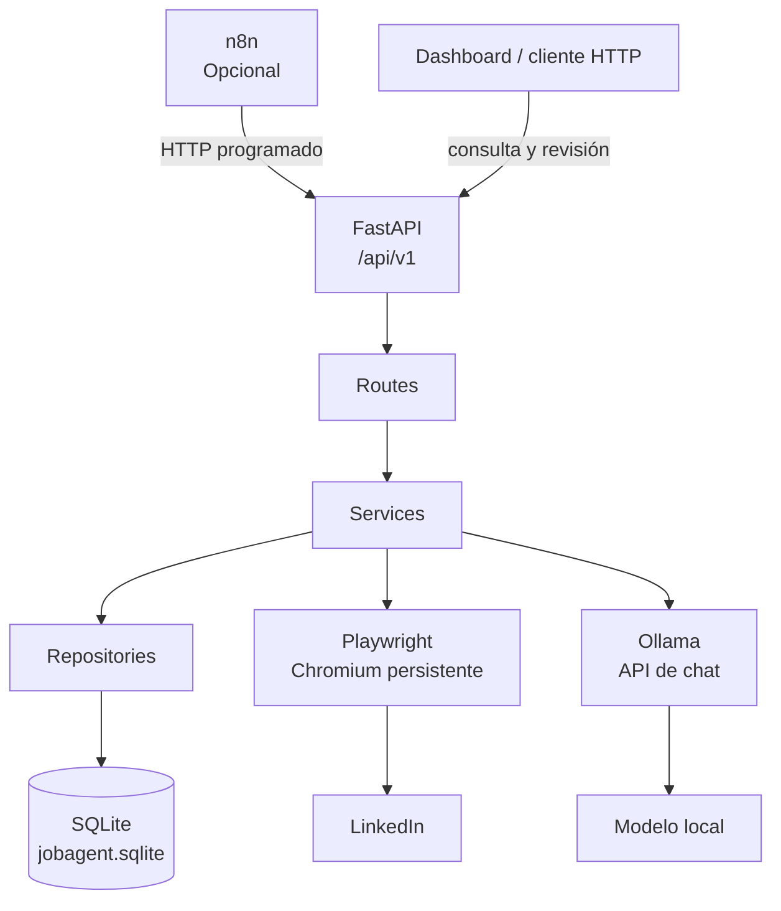
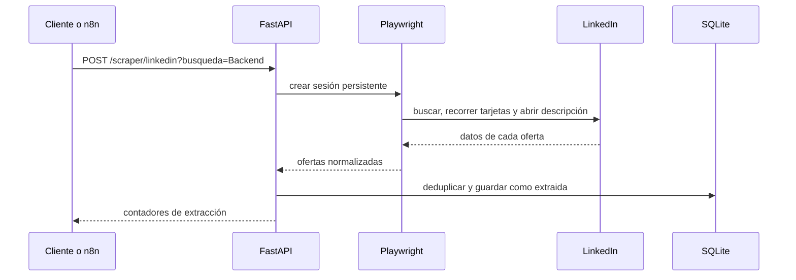
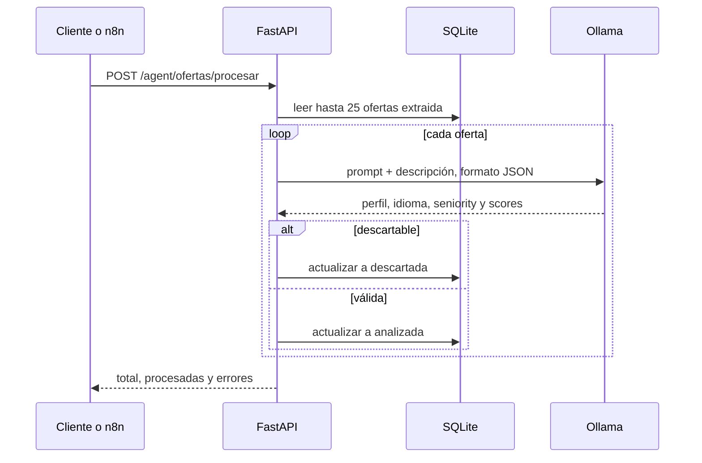
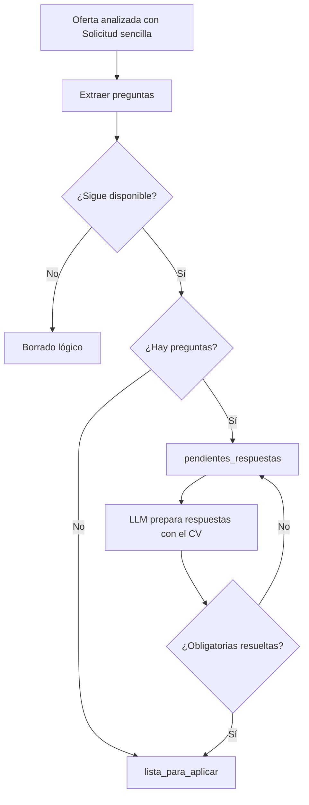

# Arquitectura de JobAgent

JobAgent está diseñado como una API local y modular. Separa las responsabilidades de automatización web, lógica de negocio, persistencia e IA para que cada parte pueda evolucionar sin acoplar la interfaz, la base de datos o el proveedor de modelo.

## Visión general

El dashboard se desarrolla en un repositorio independiente, no incluido en esta versión. Los endpoints `dashboard` y `ofertas` son el contrato que consume; su enlace se añadirá cuando el repositorio sea público.

## Papel de cada servicio

| Componente | Responsabilidad |
| --- | --- |
| FastAPI | Expone la API REST, CORS abierto y Swagger en `/docs`; enruta las operaciones bajo `/api/v1`. |
| Routes | Define los endpoints de ofertas, scraping, agente y dashboard. |
| Services | Coordina cada caso de uso: extracción, análisis, respuestas y consultas. |
| Repositories | Centraliza las consultas y actualizaciones de SQLAlchemy. |
| SQLite | Guarda ofertas, resultados de IA, preguntas, respuestas, notas y estados. |
| Playwright | Controla Chromium en modo visible y con perfil persistente para LinkedIn. |
| Ollama | Ejecuta localmente el LLM para analizar ofertas y proponer respuestas estructuradas. |
| Dashboard | Aplicación desarrollada en otro repositorio; filtra ofertas, muestra métricas y edita notas a través de la API. |
| n8n | Orquestador opcional externo: puede invocar endpoints HTTP con una cadencia programada. No forma parte del código versionado actualmente. |

## FastAPI

La aplicación se crea en `main.py` y registra cuatro routers bajo el prefijo común `/api/v1`:

- `ofertas`: listado, filtros, detalle, modificación y borrado lógico.
- `scraper`: extracción de LinkedIn y detección de preguntas Easy Apply.
- `agent`: análisis con IA y generación de respuestas.
- `dashboard`: métricas agregadas y notas.

La documentación OpenAPI generada está disponible en `/docs`. [API.md](API.md) resume el contrato operativo.

## Persistencia actual y evolución prevista

La configuración actual usa `sqlite:///jobagent.sqlite`. Es una elección pragmática para ejecución local: no requiere servidor y permite iniciar el proyecto con `python init_db.py`.

La tabla `ofertas` reúne los datos extraídos, estado del flujo, resultados de IA y datos del formulario. Los valores de `preguntas_formulario`, `respuestas_formulario` y `keywords` se almacenan como JSON. El borrado es lógico mediante `eliminado`, por lo que las consultas de listado y estadísticas excluyen esos registros. Para ofertas cerradas durante Easy Apply es una solución temporal; en una evolución posterior convendrá diferenciar explícitamente una oferta cerrada de un registro eliminado por el usuario.

La migración a PostgreSQL requiere más que cambiar la URL: añadir y configurar el driver, gestionar credenciales mediante variables de entorno o un gestor de secretos, crear migraciones, revisar la compatibilidad y consultas de columnas JSON, y definir el pool de conexiones y la estrategia de concurrencia. También será necesario probar transacciones, índices y despliegues antes de usarlo en producción.

## Flujo de scraping

El extractor de LinkedIn limita la recolección a 200 ofertas. Antes de insertar, el repositorio detecta duplicados tanto por `id_plataforma` + plataforma como por empresa y título. Las implementaciones de InfoJobs, Indeed y Glassdoor todavía no están disponibles; sus endpoints devuelven una respuesta vacía.

Playwright utiliza `profile/` como perfil persistente. Esto permite una sesión autenticada local, pero ese directorio debe tratarse como dato sensible.

## Flujo de análisis con IA

La respuesta del modelo se valida para asegurar valores conocidos de perfil, idioma y seniority. Una oferta pasa a `descartada` si el idioma es `otro`, el perfil es `desconocido` o su `score_encaje` es inferior a 35. Un fallo durante el análisis deja la oferta en `error`.

## Flujo de Easy Apply

Actualmente Easy Apply navega los pasos iniciales y extrae campos de texto, número, radio y select; después el agente genera respuestas propuestas. El rellenado automático de formularios y la selección o subida del CV todavía están en desarrollo. No pulsa los botones de revisión o envío. El agente comprueba que devuelva una respuesta para cada identificador de pregunta y que las opciones seleccionadas correspondan con las opciones reales. La aplicación final sigue siendo una acción manual y revisable.

## Decisiones de diseño

### IA local mediante Ollama

Ollama evita enviar descripciones de ofertas y datos del CV a un proveedor externo por defecto. La aplicación consume su endpoint de chat con salida JSON y permite configurar URL, modelo y timeout mediante variables de entorno.

### Automatización aislada de la API

El código de Playwright vive en `scraper/` y se invoca desde un servicio. Así el resto de la API no depende de selectores de LinkedIn y puede incorporar otros portales sin cambiar el contrato HTTP.

### Estados explícitos

El estado de una oferta (`extraida`, `analizada`, `pendientes_respuestas`, `lista_para_aplicar`, `aplicada`, `descartada` o `error`) hace visible el avance y evita que el procesamiento por lotes vuelva a tratar registros que no corresponden.

### Separación de responsabilidades

Las rutas se concentran en HTTP, los servicios en reglas de flujo y los repositorios en persistencia. El router de dashboard es una excepción consciente: accede directamente al repositorio para métricas y notas. Esta división, sin exigir que todos los casos atraviesen estrictamente una capa de servicio, facilita probar y reemplazar componentes, por ejemplo SQLite por PostgreSQL o un cliente de dashboard distinto.

### n8n como borde de orquestación

n8n es adecuado para desencadenar los endpoints en horarios definidos, encadenar extracción/análisis y notificar resultados. Mantenerlo fuera del núcleo conserva la API utilizable también desde cron, un frontend o cualquier cliente HTTP. Para incorporarlo al proyecto faltaría versionar y documentar los flujos exportados.
