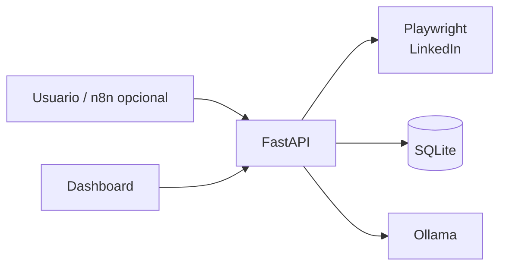

# JobAgent

JobAgent es un asistente local para descubrir ofertas de empleo en LinkedIn, analizarlas con IA y preparar las respuestas de los formularios de **Solicitud sencilla**. Su objetivo es convertir la búsqueda de empleo en un flujo revisable: extraer, clasificar, priorizar y dejar listas las candidaturas sin enviar solicitudes automáticamente.

> El proyecto usa automatización sobre LinkedIn. Revise y respete siempre sus condiciones de uso, límites y las normas aplicables antes de utilizarlo.

## Vista rápida

La interfaz visual se desarrolla en un repositorio independiente y consume los endpoints de esta API. El enlace al repositorio del dashboard se añadirá aquí cuando sea público.

<!-- Añadir aquí una captura real del dashboard cuando el repositorio público incluya assets. -->

## Características

- Extrae hasta 200 ofertas de LinkedIn por búsqueda mediante Playwright y una sesión persistente.
- Evita duplicados por identificador de plataforma o por combinación empresa/título.
- Analiza las ofertas con Ollama: idioma, seniority, perfil recomendado, puntuaciones y explicación de encaje.
- Descarta automáticamente ofertas fuera de idioma, sin perfil reconocido o con un encaje inferior a 20.
- Extrae las preguntas de LinkedIn Easy Apply y genera respuestas propuestas basadas en el CV.
- Valida que las preguntas obligatorias estén resueltas antes de marcar una oferta como lista para aplicar.
- Expone filtros, paginación, notas y métricas para un dashboard: embudo por estado, prioridades, encaje, Easy Apply, perfiles y plataformas.

## Arquitectura



Consulta una explicación de servicios, flujos y decisiones en [ARCHITECTURE.md](ARCHITECTURE.md).

## Stack

- Python 3.12+
- FastAPI y Uvicorn
- SQLAlchemy + SQLite
- Playwright (Chromium) para la automatización del navegador
- Ollama para inferencia local con LLM
- n8n, opcional, para programar y orquestar llamadas a la API

## Instalación

```bash
git clone <URL_DEL_REPOSITORIO>
cd JobAgent
python -m venv venv
source venv/bin/activate
pip install -r requirements.txt
playwright install chromium
python init_db.py
```

En Windows, activa el entorno con `venv\Scripts\activate`.

Para que Playwright reutilice una sesión de LinkedIn, ejecuta una primera extracción en modo visible e inicia sesión en la ventana que se abre. El perfil local se guarda en `scraper/profile/` y no debe compartirse ni subirse al repositorio.

## Variables de entorno

Crea un archivo `.env` en la raíz del proyecto:

```dotenv
# URL del endpoint de chat de Ollama
OLLAMA_URL=http://localhost:11434/api/chat

# Modelo que debe estar disponible localmente en Ollama
OLLAMA_MODEL=<tu_modelo>

# Opcional; 60 segundos por defecto
OLLAMA_TIMEOUT=60
```

Inicia Ollama y descarga el modelo que hayas elegido antes de procesar ofertas. Por ejemplo, consulta los modelos instalados con `ollama list`.

## CV privado

El contenido del CV es privado y `agent/prompts/cv.py` está excluido de Git. Copia `agent/prompts/cv.example.py` como `agent/prompts/cv.py` y sustituye los datos ficticios por tus CV para los perfiles e idiomas que uses.

## Ejecución

```bash
uvicorn main:app --reload
```

La API estará disponible en `http://127.0.0.1:8000`; la documentación interactiva está en `http://127.0.0.1:8000/docs`.

Ejemplo de primera extracción:

```bash
curl -X POST 'http://127.0.0.1:8000/api/v1/scraper/linkedin?busqueda=Backend'
```

El catálogo resumido de endpoints y ejemplos está en [API.md](API.md).

## Flujo de funcionamiento

1. Se extraen ofertas de LinkedIn y se guardan como `extraida`.
2. El agente las analiza con Ollama y las marca como `analizada` o `descartada`.
3. Para las ofertas analizadas con Solicitud sencilla, se extraen las preguntas; quedan `pendientes_respuestas` o `lista_para_aplicar` si no hay preguntas.
4. El agente prepara las respuestas usando el CV adecuado; la persona las revisa y confirma la oferta para dejarla en `lista_para_aplicar`.
5. La persona inicia el envío manualmente desde el dashboard o API. Playwright completa Easy Apply, elige el CV privado configurado y sólo marca la oferta como `aplicada` si LinkedIn confirma el envío.

## Roadmap

- [ ] Integrar y documentar el repositorio independiente de JobAgent Dashboard.
- [x] Rellenar automáticamente formularios Easy Apply revisados.
- [x] Seleccionar el CV correspondiente ya subido a LinkedIn.
- [ ] Subir un CV cuando no esté disponible en LinkedIn.
- [ ] Incluir flujos n8n exportables para programar extracción y análisis.
- [ ] Implementar los extractores de InfoJobs, Indeed y Glassdoor, cuyos endpoints son actualmente placeholders.
- [ ] Añadir tests automatizados, autenticación y control de acceso.
- [ ] Configurar PostgreSQL como alternativa de producción a SQLite.
- [ ] Mejorar observabilidad, reintentos y gestión de errores de proveedores externos.

## Licencia

Distribuido bajo la [licencia MIT](LICENSE).
